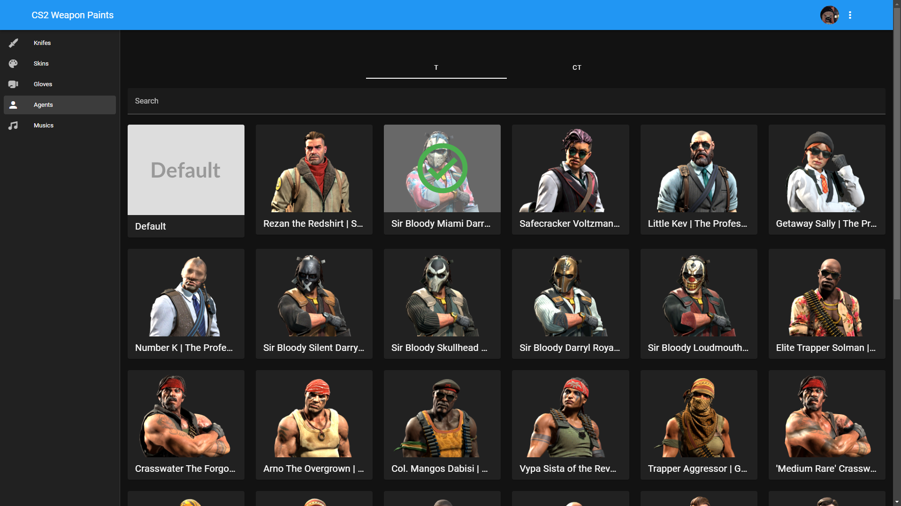
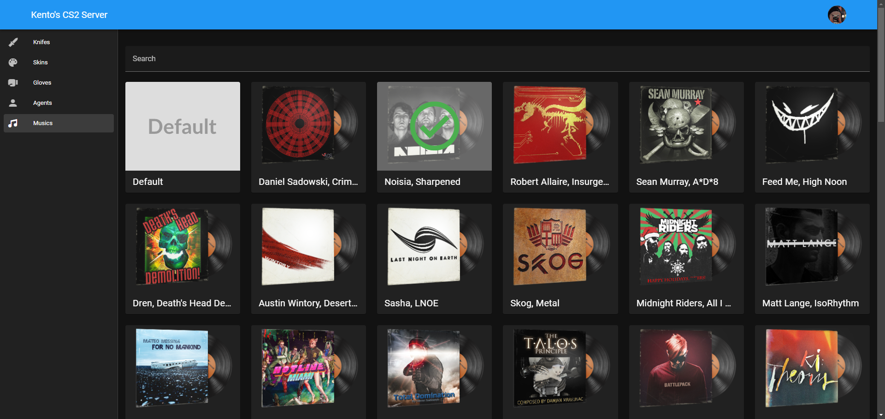
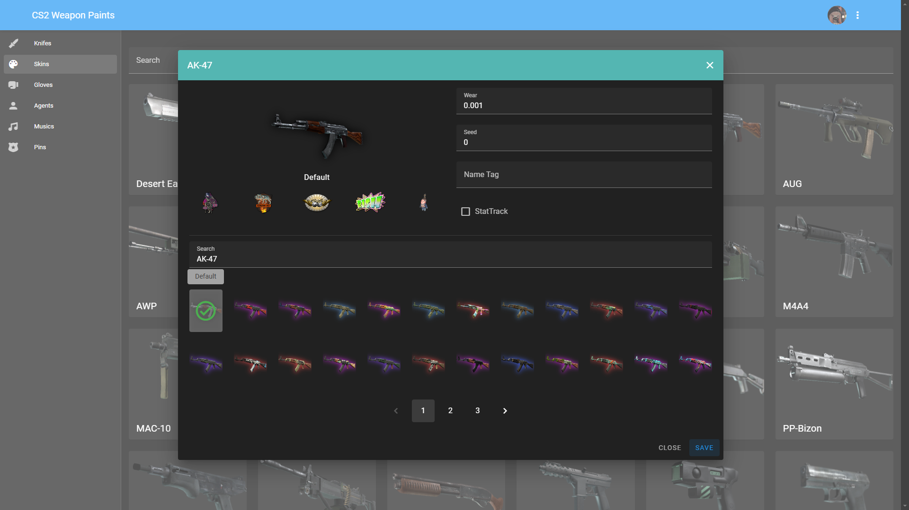

# CS2 Weapon Paints Web
A simple website to use [cs2-WeaponPaints](https://github.com/Nereziel/cs2-WeaponPaints/) plugin improved by me.

## Requirements
- PHP 7.4 or higher

## WARNING
### Use this project at your own risk! Using this may lead to GSLT ban or something else Valve come with. [Valve Server guidelines](https://blog.counter-strike.net/index.php/server_guidelines/)

## Features
- Knifes
- Skins
- Gloves
- Agents
- Music Kits  
- And Team division! (T/CT)
- Five Sitckers (Maybe Coming Soon)

**You can set every skins on every weapons, such as "P90 Fade", "AK-47 Gamma Doppler".**

## Screenshots
**It's old version's screenshots, but this project provides tabs to switch teams between knifes, skins, gloves, agents, and music kits.**
  
  

## Somthing
Thanks to Kento's good code style, I can modify it easily to add more features.
And I use AI-generated to help me to modify the codes, AI-Powered!

## License
This project is licensed under the GNU General Public License v3.0 - see the [LICENSE](LICENSE) file for details.

## Credits
- [Nereziel](https://github.com/Nereziel) - Some codes are from default weapon skins website.
- [SmItH197](https://github.com/SmItH197/SteamAuthentication) - Steam Authentication PHP functions and files.
- [Kento](https://github.com/rogeraabbccdd/CS2-WeaponPaints-Web) - The upswing of the project.